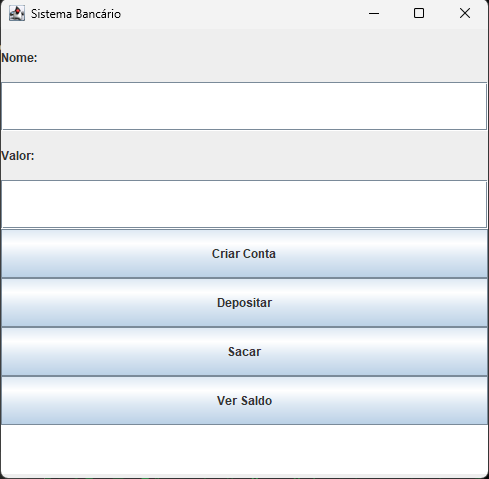

# 🏦 Sistema Bancário em Java

Aplicação desktop de simulação bancária em **Java com interface gráfica Swing**.
Projeto de estudos focado em **Orientação a Objetos** e **GUI**.

## 📸 Preview


## ✨ Funcionalidades
- ✅ Criar conta com nome e saldo inicial
- ✅ Depositar valores
- ✅ Sacar com validação de saldo
- ✅ Consultar saldo

## 🛠️ Tecnologias
- Java 8+
- Java Swing

## 🚀 Como executar
```bash
javac SystemBank/TelaPrincipal.java
java SystemBank.TelaPrincipal
```

## 📚 Conceitos aplicados
- Encapsulamento, Classes e Objetos
- ActionListener (eventos)
- Tratamento de exceções (try/catch)
- Boas práticas com SwingUtilities

## 👨‍💻 Autor
Feito com 💙 como projeto de estudos em Java.